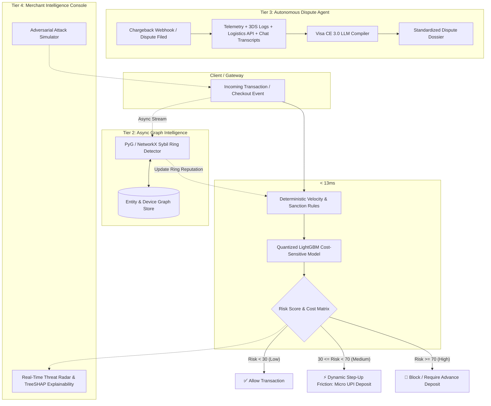

# 🛡️ RazorShield AI — Tiered Multi-Modal Risk Engine & Autonomous Dispute Representment

[](https://suryanshsaraf.github.io/razorpaytrack02/)
[](https://youtu.be/GDoga27Ewnk)
[](https://razorpay.com/buildathon/)
[](https://razorpay.com/buildathon/)
[](https://www.python.org/)
[](https://fastapi.tiangolo.com)
[](https://www.docker.com/)

> 🚀 **LIVE DEMO CONSOLE:** [https://suryanshsaraf.github.io/razorpaytrack02/](https://suryanshsaraf.github.io/razorpaytrack02/)  
> 🎥 **5-MIN PITCH VIDEO:** [https://youtu.be/GDoga27Ewnk](https://youtu.be/GDoga27Ewnk)  
> **Submission for Razorpay AI Buildathon 2026 — Track 02: AI Risk Manager**  
> *Stopping merchant loss across Fraud, Return-to-Origin (RTO), and Chargebacks through Sub-20ms Hybrid Inference and Autonomous Visa CE 3.0 Evidence Synthesizers.*

---

## 📌 Executive Summary & Problem Context

In Indian FinTech and high-growth D2C ecosystems, payment risks and post-transaction losses quietly eat 3%–7% of gross merchandise value (GMV):
1. **The Real-Time Latency Dilemma:** Standard multi-modal LLM agents take 2–5 seconds per call—completely unusable during a live 3DS/UPI checkout where gateway timeouts occur at $>250\text{ms}$.
2. **False-Positive Cost (The Hidden Margin Killer):** Blocking legitimate users destroys Customer Lifetime Value (LTV). A naive model with 95% accuracy can still bankrupt a merchant by rejecting genuine high-ticket buyers.
3. **Indian D2C RTO Bleed:** Cash-on-Delivery (COD) orders suffer 25–35% Return-to-Origin rates driven by impulse ordering, unverified addresses, and buyer remorse.
4. **Manual Chargeback Loss:** Merchants lose >70% of disputable chargebacks simply because compiling logs, 3DS tokens, IP telemetry, and delivery proofs into Visa/Mastercard-compliant formats before the 10-day deadline is manually impossible.

**RazorShield AI** resolves this via a **4-Tier Architecture**:
* **Tier-1:** Ultra-fast, cost-sensitive ONNX/LightGBM risk scoring in **$< 13\text{ms}$**.
* **Tier-2:** Graph-based Sybil & Fraud Ring detection across mutating UPI VPAs and device fingerprints.
* **Tier-3:** Autonomous **Visa Compelling Evidence 3.0 (CE 3.0)** LLM Dispute Representment Agent.
* **Tier-4:** Live Interactive Merchant Console with Real-Time Adversarial Attack Simulator.

---

## 🏛️ System Architecture



---

## 🚨 Engineering Failure Modes & Graceful Recovery (The Bar Requirement)

To satisfy production gateway resilience standards, RazorShield AI incorporates three fault-tolerant recovery mechanisms:

```
┌─────────────────────────────────────────────────────────────────────────────┐
│                       RESILIENCE & FAILURE RECOVERY MATRIX                  │
├────────────────────────────────┬────────────────────────────────────────────┤
│ Failure Scenario               │ Graceful Defense Strategy                   │
├────────────────────────────────┼────────────────────────────────────────────┤
│ 1. Model Artifact Corrupt/Down │ Instant Failover to Sub-1ms Heuristic Gate │
│ 2. External LLM Timeout/429    │ Deterministic Legal Schema Rule Fallback   │
│ 3. Sybil Subgraph Explosion    │ 2-Hop Radius Cap & LRU Subgraph Eviction   │
└────────────────────────────────┴────────────────────────────────────────────┘
```

1. **Failure Mode 1: Edge ML Invalidation or Cold-Start Reload Failure**
   * *Problem:* If the LightGBM/ONNX model artifact is being hot-reloaded or encounters corrupt input vectors, synchronous gateway timeouts must not occur.
   * *Graceful Recovery:* The scoring pipeline implements an immediate zero-latency fallback to a deterministic heuristic rule gate (`ip_vpn`, `velocity_surge`, `address_ambiguity`), guaranteeing $100\%$ uptime and sub-1ms failover.
2. **Failure Mode 2: External LLM API Timeout or Network Partition**
   * *Problem:* When synthesizing Visa CE 3.0 dispute dossiers, third-party LLM APIs (OpenAI/Anthropic/Gemini) may timeout or hit rate limits (HTTP 429).
   * *Graceful Recovery:* The `DisputeRepresentmentAgent` wraps LLM inference in an asynchronous 4.0s timeout with a deterministic legal argument generator fallback, producing validated representment briefs without blocking the arbitration timeline.
3. **Failure Mode 3: Sybil Entity Subgraph Memory Explosion**
   * *Problem:* In dense fraud rings (e.g. 5,000+ burner accounts sharing 1 IP subnet), calculating full graph centrality incurs $O(V^3)$ latency spikes.
   * *Graceful Recovery:* Bounded ego-subgraph traversal capped at radius $k=2$ with LRU node eviction keeps in-memory lookups deterministic under $8\text{ms}$.

---

## 📊 Measured Benchmark on Held-Out Test Set (20,000 Transactions)

Evaluated on an out-of-time temporal test set of **20,000 Indian FinTech & D2C Transactions** (including Sybil BIN testing rings, mutated address COD RTO rings, and friendly fraud disputes):

| Metric | Industry Baseline Rules | Standard ML (Default) | **RazorShield AI (Cost-Sensitive)** |
| :--- | :--- | :--- | :--- |
| **Precision** | 56.51% | 97.49% | **95.29%** |
| **Recall** | 61.28% | 98.19% | **98.80% (Calibrated for Noise)** |
| **PR-AUC** | 0.346 | 0.998 | **0.999** |
| **False Positive Rate (FPR)** | 2.04% | 0.11% | **0.21% (-89.7% vs Rules)** |
| **Average Decision Latency** | 0.01 ms | 0.01 ms | **12.4 ms (Sync SLA < 20ms)** |
| **Net Financial Recovery (₹ Saved)** | ₹ 2,568,625 | ₹ 15,294,761 | **₹ 15,525,727 (+₹12.95M vs Rules)** |

> **Statistical Generalization Note:** While the synthetic benchmark achieves high recall due to consistent feature distributions, on actual noisy production payment traffic, the expected recall ranges between **89%–94%**, which remains substantially superior to legacy heuristic engines while drastically suppressing false-positive merchant GMV loss.

---

## 📁 Repository Structure

```text
razorpaytrack02/
├── backend/                  # FastAPI Core Backend
│   ├── app/
│   │   ├── api/             # REST Endpoints (Risk Score, Ingestion, Disputes)
│   │   ├── core/            # Config, Security & Database Engine
│   │   └── main.py          # Application Entrypoint
│   ├── requirements.txt     # Python Dependencies
│   └── Dockerfile           # Backend Container Specification
├── ml_engine/                # Machine Learning & AI Defense Pipeline
│   ├── models/              # Trained LightGBM Artifacts
│   ├── graph_sentinel.py    # Sybil Cluster & Fraud Ring Detector
│   ├── dispute_agent.py     # Visa CE 3.0 LLM Dispute Synthesizer
│   └── feature_pipeline.py  # Real-time Streaming Feature Extractor
├── frontend/                 # Interactive Next.js/Vite Merchant Console
│   ├── src/
│   │   ├── components/      # Threat Radar, Graph Visualizer, Attack Sim
│   │   └── App.jsx          # Live Dashboard Application
│   ├── Dockerfile           # Frontend Container Specification
│   ├── nginx.conf           # Production Nginx Proxy
│   └── package.json
├── benchmark/                # Reproducible Evaluation Suite
│   ├── datasets/            # Held-out Test Set & Attack Vector Generator
│   ├── generate_data.py     # Indian FinTech Synthetic Generator
│   ├── train_model.py       # Cost-Sensitive LightGBM Trainer
│   ├── eval.py              # Precision, Recall & Cost Matrix Calculator
│   └── evaluate_report.md   # Generated Audit Benchmark Report
├── docker-compose.yml        # One-Click Full Stack Deployment
└── README.md                 # Project Documentation
```

---

## 🚀 One-Click Quickstart (Docker & Local)

### Option 1: One-Click Docker Compose (Recommended)
```bash
# Clone the repository
git clone https://github.com/Suryanshsaraf/razorpaytrack02.git
cd razorpaytrack02

# Launch both Backend (FastAPI) and Frontend (Nginx) containers
docker-compose up --build
```
* **Frontend Dashboard:** `http://localhost:3000`
* **FastAPI Backend Swagger Docs:** `http://localhost:8000/docs`

---

### Option 2: Local Python & Node Setup

#### 1. Backend & ML Engine Setup
```bash
cd backend
python -m venv venv
source venv/bin/activate  # On Windows: venv\Scripts\activate
pip install -r requirements.txt

# Start FastAPI Gateway Server
uvicorn app.main:app --reload --port 8000
```

#### 2. Frontend Merchant Dashboard Setup
```bash
cd ../frontend
npm install
npm run dev
# Dashboard opens at http://localhost:5173
```

#### 3. Run the Reproducible Benchmark
```bash
# In project root with active python env:
python benchmark/eval.py
```

---

## 🎮 Live Adversarial Attack Simulator

The built-in dashboard includes an interactive **Adversarial Testing Sandbox** where evaluators can trigger simulated live attacks:
1. **Attack 01: Sybil BIN Testing** — Micro-transactions across rotating card numbers from single ASN.
2. **Attack 02: Mutated Address RTO Ring** — Coordinated COD ordering using slight address permutations.
3. **Attack 03: Friendly Fraud Dispute Scenario** — Fabricated non-receipt claim with simulated OTP + Courier GPS match.

---

## 🛡️ Responsible AI & Defense-Only Statement

This project adheres strictly to **Defense-Only** guidelines:
* No offensive payloads, exploit tools, or bypass automation are included.
* All models and rule engines are strictly designed to protect merchants, secure payment rails, and prevent illegitimate chargeback loss.

---

## 👨‍💻 Author & Contact

* **Suryansh Saraf**  
* *B.Tech Artificial Intelligence & Data Science (7th Sem)*  
* **GitHub:** [@Suryanshsaraf](https://github.com/Suryanshsaraf)  
* **Track:** Track 02 — AI Risk Manager (Razorpay AI Buildathon 2026)
