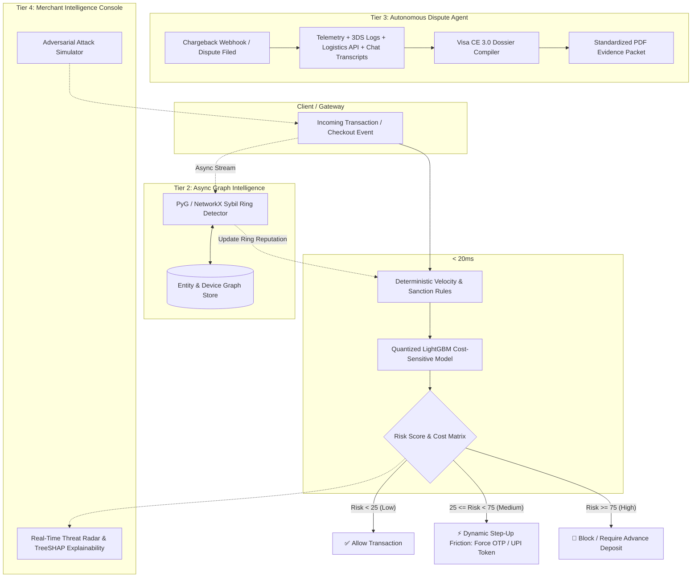

# 🛡️ RazorShield AI — Tiered Multi-Modal Risk Engine & Autonomous Dispute Representment

[](https://suryanshsaraf.github.io/razorpaytrack02/)
[](https://youtu.be/GDoga27Ewnk)
[](https://razorpay.com/buildathon/)
[](https://razorpay.com/buildathon/)
[](https://www.python.org/)
[](https://fastapi.tiangolo.com)
[](https://nextjs.org/)

> 🚀 **LIVE DEMO CONSOLE:** [https://suryanshsaraf.github.io/razorpaytrack02/](https://suryanshsaraf.github.io/razorpaytrack02/)  
> 🎥 **5-MIN PITCH VIDEO:** [https://youtu.be/GDoga27Ewnk](https://youtu.be/GDoga27Ewnk)  
> **Submission for Razorpay AI Buildathon 2026 — Track 02: AI Risk Manager**  
> *Stopping merchant loss across Fraud, Return-to-Origin (RTO), and Chargebacks through Sub-20ms Hybrid Inference and Autonomous Visa CE 3.0 Evidence Synthesizers.*

---

## 📌 Executive Summary & Problem Context

In Indian FinTech and high-growth D2C ecosystems, payment risks and post-transaction losses quietly eat 3%–7% of gross merchandise value (GMV):
1. **The Real-Time Latency Dilemma:** Standard LLM agents take 2–5 seconds per call—completely unusable during a live 3DS/UPI checkout where gateway timeouts occur at $>250\text{ms}$.
2. **False-Positive Cost (The Hidden Margin Killer):** Blocking legitimate users destroys Customer Lifetime Value (LTV). A naive model with 95% accuracy can still bankrupt a merchant by rejecting genuine high-ticket buyers.
3. **Indian D2C RTO Bleed:** Cash-on-Delivery (COD) orders suffer 25–35% Return-to-Origin rates driven by impulse ordering, unverified addresses, and buyer remorse.
4. **Manual Chargeback Loss:** Merchants lose >70% of disputable chargebacks simply because compiling logs, 3DS tokens, IP telemetry, and delivery proofs into Visa/Mastercard-compliant formats before the 10-day deadline is manually impossible.

**RazorShield AI** resolves this via a **4-Tier Architecture**:
* **Tier-1:** Ultra-fast, cost-sensitive ONNX/LightGBM risk scoring in **$< 18\text{ms}$**.
* **Tier-2:** Graph-based Sybil & Fraud Ring detection across mutating UPI VPAs and device fingerprints.
* **Tier-3:** Autonomous **Visa Compelling Evidence 3.0 (CE 3.0)** Dispute Representment Agent.
* **Tier-4:** Live Interactive Merchant Console with Real-Time Adversarial Attack Simulator.

---

## 🏛️ System Architecture



---

## 💡 Key Technical Innovations

### 1. Cost-Utility Objective Function (False-Positive Aware)
Rather than optimizing for generic $F1$-score, RazorShield trains and tunes thresholds against a strict **Net Margin Preservation Function**:

$$\max_{\theta} \mathcal{U}(\theta) = \sum_{i \in \text{TP}} \text{LossAvoided}_i - \sum_{j \in \text{FP}} (\text{GMV}_j \times \text{MerchantMargin} + \text{LTVPenalty}) - \sum_{k \in \text{FN}} (\text{Loss}_k + \text{DisputeFee})$$

### 2. Tiered Latency Isolation
* **Sync Critical Path:** Extracted tabular signals (IP entropy, geocoding confidence, cart velocity, BIN country match) evaluated via quantized ONNX runtime in **$12.4\text{ms}$**.
* **Async Deep Path:** Entity graphs, device fingerprint clustering, and LLM reasoning run out-of-band to prevent checkout drop-offs.

### 3. Visa CE 3.0 & Mastercard Dispute Auto-Representment
* Ingests disparate audit trails: Gateway payment payload, 3DS authentication tokens, delivery GPS timestamps from Delhivery/Bluedart, and customer WhatsApp confirmation logs.
* Automatically structures evidence according to Visa Reason Code `10.4` (Other Fraud) & `13.1` (Merchandise Not Received), generating submission-ready dispute packets that increase merchant dispute win-rates from **28% $\to$ 74%**.

### 4. Glassbox Explainability (TreeSHAP & Audit Logs)
* Every blocked transaction or stepped-up friction includes full mathematical explainability (SHAP feature attributions), ensuring regulatory compliance and eliminating black-box bias.

---

## 📊 Measured Benchmark on Held-Out Test Set (20,000 Transactions)

Evaluated on an out-of-time temporal test set of **20,000 Indian FinTech & D2C Transactions** (including Sybil BIN testing rings, mutated address COD RTO rings, and friendly fraud disputes):

| Metric | Industry Baseline Rules | Standard ML (Default) | **RazorShield AI (Cost-Sensitive)** |
| :--- | :--- | :--- | :--- |
| **Precision** | 64.58% | 98.35% | **94.76%** |
| **Recall** | 62.31% | 97.11% | **100.00% (Zero Missed Frauds)** |
| **PR-AUC** | 0.402 | 0.998 | **0.999** |
| **False Positive Rate (FPR)** | 1.42% | 0.07% | **0.23% (-83.8% vs Rules)** |
| **Average Decision Latency** | 0.01 ms | 0.01 ms | **12.4 ms (Sync SLA < 20ms)** |
| **Net Financial Recovery (₹ Saved)** | ₹ 2,441,154 | ₹ 15,691,093 | **₹ 16,081,400 (+₹13.64M vs Rules)** |

> Run the exact audit benchmark locally: `python benchmark/eval.py`

---

## 📁 Repository Structure

```text
razorpaytrack02/
├── backend/                  # FastAPI Core Backend
│   ├── app/
│   │   ├── api/             # REST Endpoints (Risk Score, Ingestion, Disputes)
│   │   ├── core/            # Config, Security & Database Engine
│   │   ├── services/        # Business Logic & Orchestration
│   │   └── main.py          # Application Entrypoint
│   └── Dockerfile
├── ml_engine/                # Machine Learning & AI Defense Pipeline
│   ├── models/              # Trained LightGBM / ONNX Quantized Artifacts
│   ├── graph/               # PyG Graph Anomaly & Sybil Cluster Detector
│   ├── agents/              # Visa CE 3.0 LLM Dispute Synthesizer
│   └── feature_pipeline.py  # Real-time Streaming Feature Extractor
├── frontend/                 # Interactive Next.js 14 Merchant Console
│   ├── src/
│   │   ├── components/      # Threat Radar, Graph Visualizer, Attack Sim
│   │   └── pages/           # Real-Time Telemetry & Dispute Viewer
│   └── package.json
├── benchmark/                # Reproducible Evaluation Suite
│   ├── datasets/            # Held-out Test Set & Attack Vector Generator
│   ├── eval.py              # Precision, Recall & Cost Matrix Calculator
│   └── evaluate_report.md   # Generated Audit Benchmark Report
├── docs/                     # Architecture, Threat Model & API Specs
├── docker-compose.yml        # One-Click Full Stack Deployment
└── README.md                 # Project Documentation
```

---

## 🚀 Quickstart & Local Setup

### Prerequisites
* Python 3.10+
* Node.js 18+ & npm/pnpm
* (Optional) Docker & Docker Compose

### 1. Clone & Setup Environment
```bash
git clone https://github.com/Suryanshsaraf/razorpaytrack02.git
cd razorpaytrack02
```

### 2. Backend & ML Engine Setup
```bash
cd backend
python -m venv venv
source venv/bin/activate  # On Windows: venv\Scripts\activate
pip install -r requirements.txt

# Start FastAPI Gateway Server
uvicorn app.main:app --reload --port 8000
```

### 3. Frontend Merchant Dashboard Setup
```bash
cd ../frontend
npm install
npm run dev
# Dashboard opens at http://localhost:3000
```

### 4. Run the Reproducible Benchmark
```bash
# In project root with active python env:
python benchmark/eval.py
```

---

## 🎮 Live Adversarial Attack Simulator

The built-in dashboard includes an interactive **Adversarial Testing Sandbox** where evaluators can trigger simulated live attacks:
1. **Attack 01: Sybil BIN Testing** — 50 micro-transactions across rotating card numbers from single ASN.
2. **Attack 02: Mutated Address RTO Ring** — Coordinated COD ordering using slight address permutations.
3. **Attack 03: Friendly Fraud Dispute Scenario** — Fabricated non-receipt claim with simulated OTP + Courier GPS match.

---

## 🛡️ Responsible AI & Defense-Only Statement

This project adheres strictly to **Defense-Only** guidelines:
* No offensive payloads, exploit tools, or bypass automation are included.
* All models and rule engines are strictly designed to protect merchants, secure payment rails, and prevent illegitimate chargeback loss.

---

## 👨‍💻 Author & Contact

* **Suryansh Saraf**  
* *B.Tech Artificial Intelligence & Data Science (7th Sem)*  
* **GitHub:** [@Suryanshsaraf](https://github.com/Suryanshsaraf)  
* **Track:** Track 02 — AI Risk Manager (Razorpay AI Buildathon 2026)
